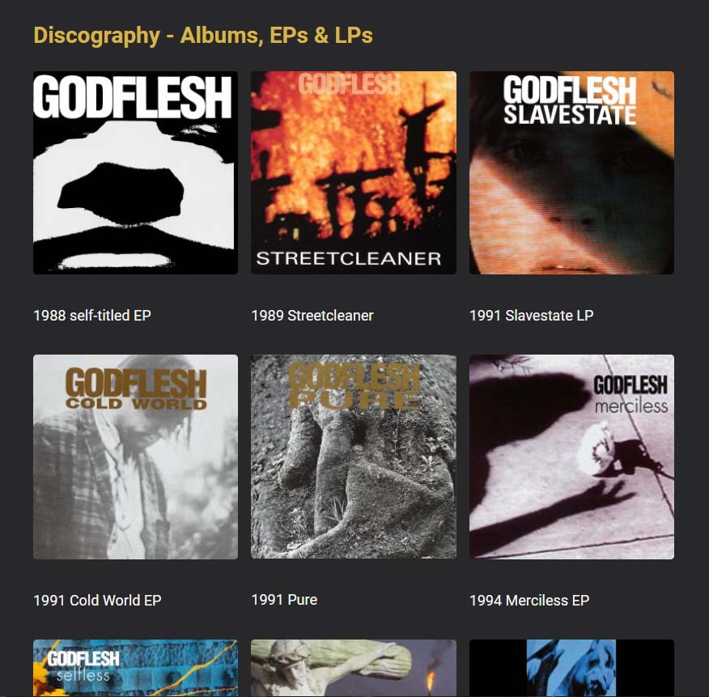

# Godflesh Tribute Page

This is a customization of the first project in Scrimba's Module 6 (Responsive Design). The original design was a responsive remake of the first project in Module 4 (Essential CSS Concepts). I've converted it into a tribute page for the band, [Godflesh](https://godflesh.com/).

Deployed at: https://vish213-godflesh.netlify.app/

## CSS concepts

- CSS variables
- line-height (unitless, to preserve ratio with font-size)
- text-decoration
- element:hover
- element:active
- element:not
- display: flex
    - flex-wrap
    - gap
    - flex: 1
    - justify-content
    - align-items
- object-fit
- list-style-type
- last-child
- media queries

## HTML concepts

- Google fonts
- Semantic HTML
    - header
    - nav
    - main
    - section
    - footer
- Unordered lists
- Anchor tags
    - named anchors
    - target="blank"
- classes
- IDs
